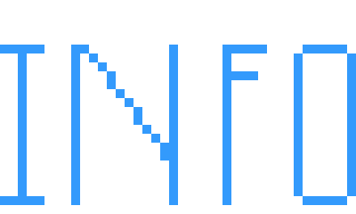

# About this repository

  <picture>
    <source media="(prefers-color-scheme: dark)" srcset="./public/readme_imgs/informatioa.2.png" width="700px">
    
  </picture>

### WARNING, THIS CAN BE SPOILERS. PLEASE, DON'T SAY TO OTHERS PERSONS ABOUT THIS.

This is a repository for a site of a studio that makes games and apps. The name that you can see on the repository name is Informatioa, Yes, Informatioa.

### THIS INFORMATION DON'T HAVE MORE SPOILERS.

## Projects

  <picture>
    <source media="(prefers-color-scheme: dark)" srcset="./public/readme_imgs/background_account-creator.png">
    
  </picture>

| **Project name** | **Reason that this project exist** |
| --- | --- |
| City Update | A new game which simulates a city of Montevideo. |
| DevMessanger | App for talk with developers. |
| Informatioa Sites | A site which on this site you can find sites of other persons or create your own site. |
| Mechadog | A bot of Discord which can make much things. You can use it in your server. |
| ChannelXBot | My Telegram bot. |

## Emailer

<picture>
  <source media="(prefers-color-scheme: dark)" srcset="./public/readme_imgs/emailverification.png">
  
</picture>

Informatioa have an emailer that can send emails to persons on the time that this is needed.

Emailer repository:
[Repository on GitHub](https://github.com/nico1monte/informatioa_emailer)
